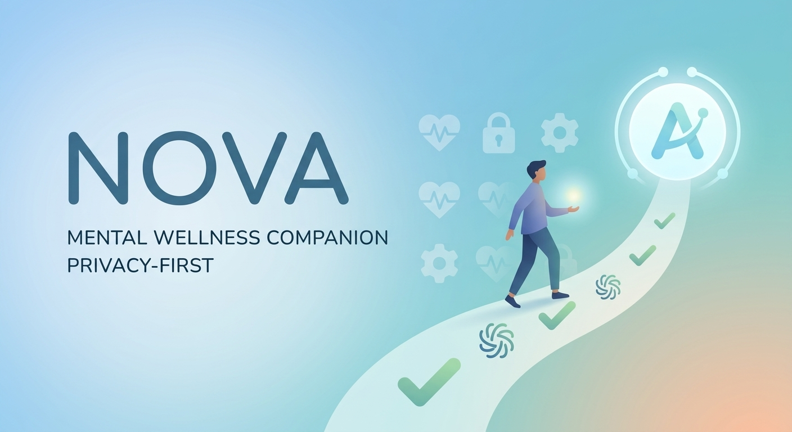

# NOVA

> Status: protótipo funcional em preparação para produção. As funcionalidades disponíveis e as limitações reais estão descritas abaixo.

Para instalação, validação, segurança e deploy, consulte `docs/`.

<p align="center">
  
</p>

<p align="center">
  <strong>A privacy-first mental wellness platform built around responsible AI.</strong>
</p>

<p align="center">
  NOVA helps users understand their daily well-being, recognise personal patterns, and make small changes to their routines.
</p>

---

## About NOVA

NOVA is a privacy-first mental wellness platform designed to help people better understand the relationship between their daily routines and their reported well-being.

The idea behind NOVA came from a simple observation: students and young professionals often experience stress, emotional fatigue, lack of rest, and unhealthy routines without being able to clearly understand the patterns behind them.

Instead of trying to diagnose a person, NOVA focuses on **self-awareness, prevention, and responsible support**.

The platform gives users a simple way to reflect on their day, build a history of their own experiences, identify patterns over time, and receive suggestions for small and realistic routine changes.

> **NOVA is not a medical or diagnostic system and does not replace qualified mental health professionals.**

---

## The Problem

Daily well-being is influenced by many different aspects of everyday life.

Sleep, workload, study time, breaks, routine consistency, and other habits can change how a person experiences their day.

The problem is that these relationships are difficult to see when looking at only one day at a time.

For example:

```text
Day 1  → tired
Day 2  → normal
Day 3  → tired
Day 4  → productive
Day 5  → tired
```

It is difficult to understand what is happening just by looking at individual days.

NOVA tries to make the bigger picture easier to see.

Instead of asking:

> "What is wrong with me?"

NOVA asks:

> "What patterns can I observe in my routine?"

---

## How NOVA Works

The main flow of the platform is:

```text
        Daily Check-in
              │
              ▼
       User Information
              │
              ▼
       Pattern Analysis
              │
              ▼
       AI-assisted Insight
              │
              ▼
      Routine Suggestion
              │
              ▼
       Future Check-ins
              │
              └──────────────► New Patterns
```

The system becomes more useful over time because the user can compare their current experience with their previous check-ins.

---

# Core Features

## Well-being Check-ins

Users can regularly record how they are feeling and reflect on their day.

The check-in experience is designed to be simple and quick, reducing the amount of effort required to maintain a consistent history.

---

## Pattern Detection

NOVA analyses information collected through check-ins and looks for recurring relationships between routines and reported well-being.

For example:

```text
Less rest
    +
Long study/work sessions
    ↓
More frequent fatigue reports
```

The important distinction is that NOVA treats this as a **pattern observed in the user's information**, not as a medical conclusion.

---

## Personalised Insights

NOVA transforms collected information into understandable observations.

Instead of forcing the user to analyse raw historical data, the platform can highlight patterns such as:

* periods where reported energy tends to decrease;
* relationships between rest and reported well-being;
* changes associated with routine consistency;
* recurring patterns in daily habits.

The purpose is to help the user understand their own information.

---

## Routine Support

When a pattern is identified, NOVA can suggest small and realistic changes that the user can experiment with.

The system does not prescribe a specific lifestyle.

Instead, the idea is:

```text
Observed pattern
       ↓
Possible insight
       ↓
Small change
       ↓
Observe what happens
```

The user remains in control of what they choose to do.

---

# Architecture

NOVA uses a **layered architecture with separation between the presentation, application, data, and AI responsibilities**.

This approach was chosen because NOVA works with potentially sensitive well-being information and also introduces AI into the application.

I did not want the frontend, business logic, database access, and AI processing to be tightly coupled.

The high-level architecture is:

```text
┌──────────────────────────────────────┐
│          Presentation Layer           │
│          React / Next.js              │
└───────────────────┬──────────────────┘
                    │
                    ▼
┌──────────────────────────────────────┐
│          Application Layer            │
│      Business Logic / API / Rules     │
└───────────────────┬──────────────────┘
                    │
             ┌──────┴──────┐
             │             │
             ▼             ▼
┌──────────────────┐ ┌──────────────────┐
│    Data Layer    │ │     AI Layer     │
│                  │ │                  │
│ Persistence      │ │ Pattern analysis │
│ Data access      │ │ Insights         │
│ User information │ │ Suggestions      │
└──────────────────┘ └──────────────────┘
```

---

## Why a Layered Architecture?

The main reason for this architecture is **separation of responsibilities**.

A wellness platform should not have UI components directly accessing the database or controlling AI behaviour.

Instead, information follows a controlled path:

```text
User
  │
  ▼
Interface
  │
  ▼
Application Layer
  │
  ├── Validation
  ├── Authentication
  ├── Authorisation
  └── Business Rules
  │
  ├───────────────┐
  ▼               ▼
Data Layer      AI Layer
  │               │
  └───────┬───────┘
          ▼
       Result
          │
          ▼
        User
```

This makes the application easier to maintain and gives me a clear place to enforce security and privacy rules before sensitive information reaches other services.

It also makes it possible to change the AI implementation or data layer later without having to rebuild the entire application.

---

# Architecture Responsibilities

### Presentation Layer

Responsible for:

* user interface;
* user interactions;
* displaying insights;
* collecting check-ins;
* communicating with application services.

The presentation layer should not be responsible for security-critical business rules.

---

### Application Layer

This is the main control point of the application.

It handles:

* business logic;
* request validation;
* authentication;
* authorisation;
* application rules;
* coordination between services;
* controlling AI requests.

This layer acts as a boundary between the user interface and sensitive resources.

---

### Data Layer

Responsible for:

* storing user information;
* retrieving information;
* data modelling;
* controlled data access.

Because the application can contain sensitive well-being information, database access should not be exposed directly to the frontend.

---

### AI Layer

The AI layer is responsible for tasks such as:

* analysing permitted information;
* identifying patterns;
* generating understandable insights;
* suggesting general routine changes.

The AI layer does **not** own the user's data and does not control the rest of the application.

The application decides what information can be sent for AI processing and how the generated result is handled.

---

# Data Flow

A typical check-in can follow this process:

```text
┌──────────┐
│   User   │
└────┬─────┘
     │
     ▼
┌──────────────┐
│  Check-in    │
└────┬─────────┘
     │
     ▼
┌──────────────┐
│  Validation  │
└────┬─────────┘
     │
     ▼
┌──────────────┐
│ Application  │
│    Layer     │
└────┬─────────┘
     │
     ├───────────────┐
     ▼               ▼
┌──────────┐   ┌──────────┐
│ Database │   │    AI    │
└────┬─────┘   └────┬─────┘
     │              │
     └───────┬──────┘
             ▼
        ┌─────────┐
        │ Insight │
        └────┬────┘
             │
             ▼
           User
```

This structure helps prevent the AI component from becoming an unrestricted entry point into the rest of the application.

---

# Responsible AI

Responsible AI is one of the main design principles of NOVA.

Mental wellness is a sensitive area, so the AI cannot simply be treated as another chatbot.

The system needs clear boundaries around what it can and cannot do.

### NOVA uses AI to:

* identify patterns;
* help interpret user-provided information;
* generate supportive insights;
* suggest general routine changes;
* support self-reflection.

### NOVA does not use AI to:

* diagnose mental health conditions;
* determine that a user has a specific disorder;
* prescribe medication;
* provide medical treatment;
* replace qualified professionals;
* make important decisions on behalf of users.

The distinction is fundamental:

```text
Observed pattern
       ≠
Medical diagnosis
```

---

# AI Safety Policies

The AI layer is designed around explicit safety boundaries.

### No diagnosis

Patterns found in user information must not be presented as a medical diagnosis.

### No false certainty

The system should avoid presenting AI-generated interpretations as established facts when there is uncertainty.

### No medical treatment

NOVA does not prescribe medication or attempt to provide clinical treatment.

### No manipulation

The system should not attempt to create emotional dependency or pressure users into following its recommendations.

### Human agency

Users remain responsible for their own choices.

AI suggestions are suggestions, not instructions.

### Appropriate escalation

When a situation goes beyond what a wellness application should handle, the system should encourage the user to seek appropriate human or professional support instead of attempting to act as a replacement.

---

# Security & Privacy

Privacy is part of the architecture of NOVA because the platform can process information about a person's well-being.

The main security principles are:

### Data Minimisation

Only information necessary for the intended functionality should be collected.

### Least Privilege

Each component should have only the permissions it needs.

### Controlled Access

Sensitive information should only be accessible through authorised application flows.

### Backend Security

Security-critical validation, authorisation, and business rules should be enforced on the backend rather than relying only on the client.

### Secure Communication

Communication between application components should use appropriate secure transport.

### Secret Protection

Credentials and other secrets should never be stored in the source code or committed to the repository.

### User Control

Users should have meaningful control over their own information.

---

# Privacy by Design

Privacy is not something that should be added after the product is finished.

For NOVA, privacy influences architectural decisions from the beginning.

The basic principle is:

```text
Collect
   ↓
Validate
   ↓
Control access
   ↓
Process only when necessary
   ↓
Return useful result
```

The AI should receive only the information necessary for the operation being performed.

This helps reduce unnecessary exposure of sensitive information.

---

# Technology

NOVA is built around a modern web stack:

* **Next.js**
* **React**
* **TypeScript**
* **Node.js**
* **API-based services**
* **Database layer**
* **AI services**

The technology choices support the architectural goals of keeping the interface, application logic, data access, and AI functionality separated.

---

# Design

The interface was designed to feel calm and simple.

Since the platform is something users may interact with regularly, I wanted to avoid unnecessary complexity and information overload.

The main design principles are:

* simple navigation;
* clear visual hierarchy;
* minimal friction;
* accessible interactions;
* readable information;
* calm visual language.

The interface should make the user feel that NOVA is a tool for reflection rather than another application demanding their attention.

---

# Challenges

The biggest challenge was not connecting an AI model to the application.

The difficult part was deciding **what the AI should be allowed to do**.

In a sensitive area such as mental wellness, a technically correct AI response can still be inappropriate.

This meant thinking about:

* privacy;
* data exposure;
* responsible AI;
* AI limitations;
* misleading health claims;
* user autonomy;
* safety boundaries.

Another challenge was designing the architecture so that these requirements could be enforced technically rather than relying only on instructions given to the AI.

---

# What I Learned

Building NOVA showed me that an AI product is much more than the model behind it.

The surrounding architecture matters just as much.

I had to think about:

* where information comes from;
* where it is stored;
* who can access it;
* what information reaches the AI;
* how AI output is handled;
* what happens when the AI is uncertain;
* where the boundaries of the system should be.

This project also made me think more carefully about the relationship between **software engineering, privacy, security, and responsible AI**.

---

# Roadmap

## Product

* [ ] Improve daily check-ins
* [ ] Add richer personal trends
* [ ] Improve insight visualisation
* [ ] Expand routine support
* [ ] Improve accessibility
* [ ] Mobile application

## AI

* [ ] Improve pattern detection
* [ ] Improve insight generation
* [ ] Add stronger output validation
* [ ] Improve uncertainty handling
* [ ] Expand responsible AI evaluation

## Privacy & Security

* [ ] More granular privacy controls
* [ ] Improved data-management features
* [ ] Security testing
* [ ] Better auditability
* [ ] Continuous privacy reviews

---

# Contributing

Contributions are welcome.

If you want to contribute to NOVA, please consider the project's principles when making changes, especially around personal information and AI behaviour.

Changes should consider:

* security;
* privacy;
* responsible AI;
* accessibility;
* maintainability;
* user control.

---

# Author

## Ana Juliana Sobrinho

Software Engineer interested in building practical software, user-centred products, and responsible applications of technology.

**GitHub:**
[github.com/ajacs10](https://github.com/ajacs10?utm_source=chatgpt.com)

**LinkedIn:**
[linkedin.com/in/ana-juliana-sobrinho/](https://linkedin.com/in/ana-juliana-sobrinho/?utm_source=chatgpt.com)

---

# Licence

This project is currently being developed as an independent project.

